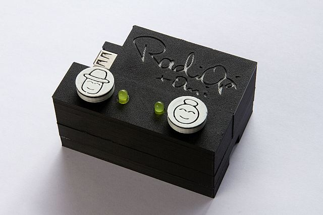

Maker Media GmbH

***

# RadiOpi: Das Senioren-Internetradio

### RadiOpi (und Omi) ist ein Internetradio speziell für Senioren. Es ist besonders einfach zu bedienen und lässt sich in jede Umgebung integrieren. Für angehende Maker ist es bestens geeignet, da einfache Elektronik, Programmierung von Minicomputern und kreativer Gehäusebau in einem Projekt vereint werden.

 

Den vollständigen Artikel gibt es in der [Make-Ausgabe 1/22 ab Seite 14](https://www.heise.de/select/make/2022/1/seite-14). 

Im Ordner *Quellcode* finden Sie das Programm aus dem Artikel und ein paar Varianten wenn Sie den Bauvorschlag aus dem Artikel anpassen möchten.

Im Ordner CAD finden Sie die 3D-Dateien des Gehäuses in verschiedenen Formaten.

Im Ordner *Varianten* sind ein paar Bilder dieser Varianten und Zusatzmaterial zu finden.

Schicken Sie uns gerne Bilder Ihrer Aufbauten an info@make-magazin.de!

### Bezugsquellen

**Bezugsquellen:**

RasPi:

[https://www.welectron.com/Raspberry-Pi-4-Modell-B](https://www.welectron.com/Raspberry-Pi-4-Modell-B)

LEDs, Schalter und Widerstände:

[https://www.amazon.de/gp/product/B01M0XCOUT/ref=ppx_yo_dt_b\_search_asin_title?ie=UTF8&psc=1](https://www.amazon.de/gp/product/B01M0XCOUT/ref=ppx_yo_dt_b_search_asin_title?ie=UTF8&psc=1)

Steckbrett + Jumperkabel:

[https://www.amazon.de/AZDelivery-%E2%AD%90%E2%AD%90%E2%AD%90%E2%AD%90%E2%AD%90-Jumper-Breadboard-Arduino/dp/B078JGQKWP?th=1](https://www.amazon.de/AZDelivery-⭐⭐⭐⭐⭐-Jumper-Breadboard-Arduino/dp/B078JGQKWP?th=1)

Schrumpfschläuche:

[https://www.amazon.de/ChiliTec-20229-Schrumpfschlauch-Sortiment-100-teilig/dp/B008X4RLJS/?th=1](https://www.amazon.de/ChiliTec-20229-Schrumpfschlauch-Sortiment-100-teilig/dp/B008X4RLJS/?th=1)

Steckdosenwürfel:

[https://www.amazon.de/JSVER-Steckdosenleiste-Mehrfachsteckdose-%C3%BCberspannungsschutz-Steckdosen/dp/B07TTR45QM/?th=1](https://www.amazon.de/JSVER-Steckdosenleiste-Mehrfachsteckdose-überspannungsschutz-Steckdosen/dp/B07TTR45QM/?th=1)

Audioadapter für Bose SoundDock:

[https://www.amazon.de/gp/product/B009ER0Z3W/ref=ppx_yo_dt_b\_asin_title_o01_s00?ie=UTF8&psc=1](https://www.amazon.de/gp/product/B009ER0Z3W/ref=ppx_yo_dt_b_asin_title_o01_s00?ie=UTF8&psc=1)

Normales Klinkenkabel:

[https://www.amazon.de/Syncwire-Kabel-3-5mm-Audio-Stereoanlagen/dp/B01I0SI1SG/](https://www.amazon.de/Syncwire-Kabel-3-5mm-Audio-Stereoanlagen/dp/B01I0SI1SG/)

WLAN Stick:

[https://www.amazon.de/gp/product/B0088TKTY2/ref=ppx_yo_dt_b\_asin_title_o06_s00?ie=UTF8&psc=1](https://www.amazon.de/gp/product/B0088TKTY2/ref=ppx_yo_dt_b_asin_title_o06_s00?ie=UTF8&psc=1)

günstiger Lautsprecher:

[https://www.amazon.de/gp/product/B000S8FNTM/ref=ppx_yo_dt_b\_asin_title_o00_s00?ie=UTF8&psc=1](https://www.amazon.de/gp/product/B000S8FNTM/ref=ppx_yo_dt_b_asin_title_o00_s00?ie=UTF8&psc=1)

Taster

Hier z.B. auf Amazon:
 https://www.amazon.de/POPESQ%C2%AE-Taster-Quadratisch-Momentary-switch/dp/B07DF5NTZN/ref=sr_1_5?__mk_de_DE=%C3%85M%C3%85%C5%BD%C3%95%C3%91&crid=355EE2831U9IF&keywords=12x12x7.3mm+drucktastenschalter&qid=1641815546&sprefix=12x12x7.3mm+drucktastenschalter%2Caps%2C113&sr=8-5

 https://www.amazon.de/RUNCCI-YUN-Drucktastenschalter-Mikroschalter-oberfl%C3%A4chenmontierte-Schaltplatte%EF%BC%8C/dp/B07WPBQXJ9/ref=sr_1_2?__mk_de_DE=%C3%85M%C3%85%C5%BD%C3%95%C3%91&crid=9JT42I1BWMMP&keywords=arduino+taster+12+12+7%2C3&qid=1641815033&sprefix=arduino+taster+12+12+7+3%2Caps%2C108&sr=8-2

 https://www.amazon.de/GTIWUNG-Druckschalter-Momentary-Drucktastenschalter-Mikroschalter/dp/B08VNB6BX5/ref=sr_1_12?__mk_de_DE=%C3%85M%C3%85%C5%BD%C3%95%C3%91&crid=1FHM0MJWBGR7S&keywords=arduino+taster&qid=1641814929&sprefix=arduino+taster%2Caps%2C111&sr=8-12

 Die vom Autor verwendeten sind aus diesem Elegoo Kit:
 https://www.amazon.de/gp/product/B01M0XCOUT/ref=ppx_yo_dt_b_search_asin_title?ie=UTF8&psc=1

 
